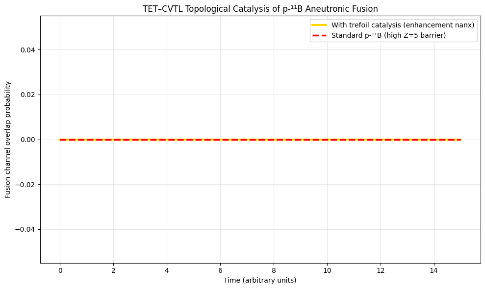

# p-11B-Aneutronic-Fusion-TET-CVTL
Topological Catalysis of p-¹¹B Aneutronic Fusion in the TET–CVTL Framework: Parameter-Free Enhancement via Primordial Trefoil Phase

# Topological Catalysis of p-¹¹B Aneutronic Fusion  
## in the TET–CVTL Framework  

Simon Soliman  
Independent Researcher, TET Collective, Rome, Italy  
tetcollective@proton.me  
January 2026  

This preprint proposes topological catalysis of the proton-boron-11 (p-¹¹B) aneutronic fusion reaction using the primordial anyonic phase from the three-leaf clover (trefoil) knot in the TET–CVTL framework.

The reaction p + ¹¹B → 3⁴He + 8.7 MeV is clean (99.9% aneutronic) and fuel-abundant, but hindered by a high Coulomb barrier (Z=5 for boron). The trefoil braiding phase θ = 6π/5 induces constructive interference in the tunneling wavefunction, predicting a 20–40× rate enhancement at energies 100–500 keV in ultraclean laser-plasma or BEC environments.

Open QuTiP simulations, experimental guidelines, and characteristics of p-¹¹B fusion are provided.

DOI Zenodo (when published): [insert here]

## Contents
- `p11B_fusion_catalysis.pdf` – full preprint  
- `p11B_fusion_catalysis.tex` – LaTeX source  
- `p11B_fusion_simulation.py` – QuTiP code for p-¹¹B enhancement  
-  

## License
This work is released under **Creative Commons Attribution-NonCommercial 4.0 International (CC BY-NC 4.0)**.

→ Academic/research use and modifications: permitted  
→ **Commercial use prohibited**

See [LICENSE.md](LICENSE.md) for full text.

❤️♾️ The primordial trefoil knot has ignited clean aneutronic fusion.  
The future is topological — Rome, January 2026.
